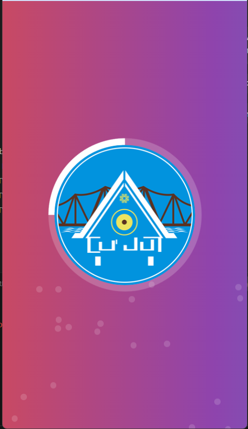
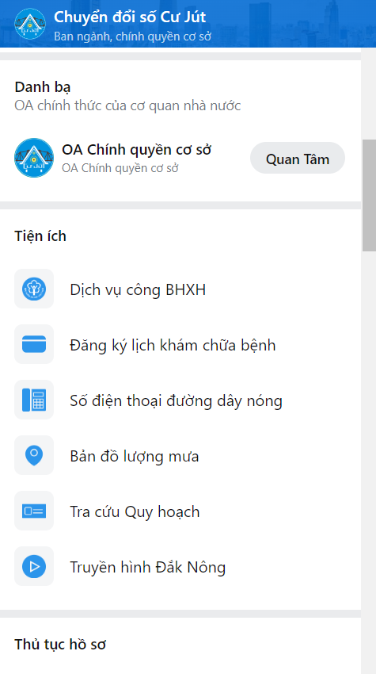
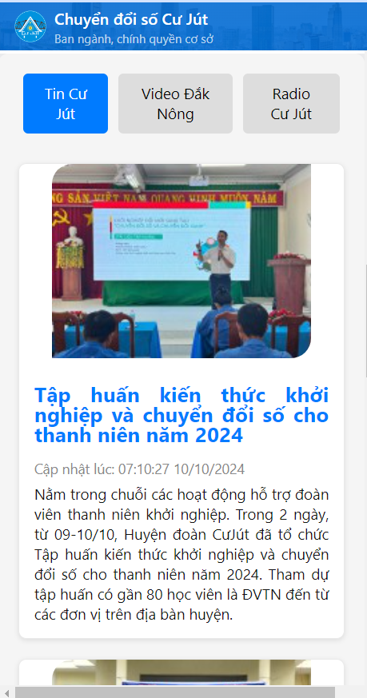
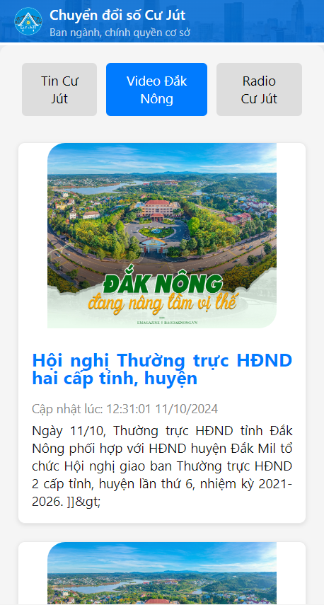
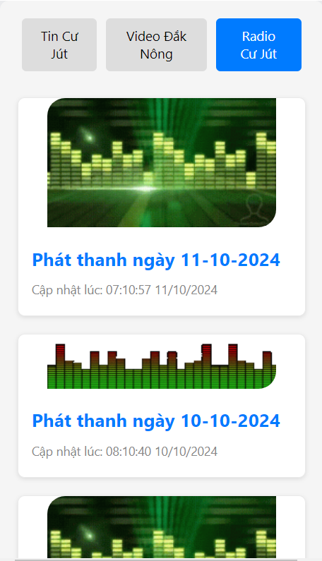

<<<<<<< HEAD
# Cư Jút 24H - Ứng dụng mini trên Zalo Chuyển đổi số Cư Jút

## Mô tả hệ thống

- [Tổng quan](#tổng-quan)
- [Cấu trúc dự án](#cấu-trúc-dự-án)
- [Quản lý trạng thái](#quản-lý-trạng-thái)
- [Cài đặt](#cài-đặt)
- [Cấu hình](#cấu-hình)
- [Scripts](#scripts)
- [Bản quyền](#bản-quyền)

## Tổng quan

Sử dụng mẫu ứng dụng Chính phủ điện tử trên Zalo Mini App.

### Ảnh chụp màn hình

|                                                                            |                                                                       |                                                                       |
| :------------------------------------------------------------------------: | :-------------------------------------------------------------------: | :-------------------------------------------------------------------: |
|      | | |
|      | | |

### Demo

Quét mã QR bằng Zalo để xem thử ứng dụng Mini.


## Cấu trúc dự án

Dự án tuân thủ một cấu trúc rõ ràng để tổ chức mã nguồn. Dưới đây là sơ lược về các thư mục chính và nội dung của chúng:

```shell
.
.
├── src
│   ├── components
│   │   ├── UIComponent1
│   │   │   ├── index.ts
│   │   │   └── UIComponent1.tsx
│   │   ├── UIComponent2
│   │   │   ├── index.ts
│   │   │   └── UIComponent2.tsx
│   │   └── ...
│   ├── services
│   │   ├── services.ts
│   │   ├── services.mock.ts
│   │   └── zalo.ts
│   ├── mock
│   │   ├── db.json
│   ├── pages
│   │   ├── [PageName]
│   │   │   ├── index.ts
│   │   │   └── [PageName].tsx
│   │   ├── Page1
│   │   │   ├── index.ts
│   │   │   └── Page1.tsx
│   │   ├── Page2
│   │   │   ├── index.ts
│   │   │   ├── Section1.tsx
│   │   │   ├── Section2.tsx
│   │   │   └── Page2.tsx
│   │   └── ...
│   ├── constants
│   │   └── common.ts
│   ├── utils
│   ├── types
│   ├── css
│   │   ├── global.css
│   │   ├── tailwind.css
│   └── assets
│       ├── image1.png
│       ├── image2.png
│       └── ...
├── .env
├── .env.production
├── .env.development
├── .gitignore
├── package.json
└── README.md
```

## Quản lý trạng thái

Chức năng quản lý trạng thái được tích hợp trong dự án qua Recoil.

## Cài đặt

1. Cài đặt [Node.js](https://nodejs.org).
2. Chạy lệnh sau để cài đặt các phụ thuộc bằng **yarn**:

```shell
yarn install
```

Nếu dùng **npm**, sử dụng:

```shell
npm install
```

## Cấu hình

Cấu hình dự án bằng cách cập nhật URL và API trong file `src/constants/common.ts` và tệp `.env`.

### API Endpoints

```ts
export const API = {
    GET_ORGANIZATION: "/get_organization_api",
    SEARCH_PROFILES: "/search_profiles_api",
};
```

## Scripts

- **`npm start`**: Khởi động dự án.
- **`npm deploy`**: Triển khai dự án.

## Bản quyền

Dự án này thuộc bản quyền của **Cư Jút 24H**. Email liên hệ: **hung@dno.vn**. Mọi hành vi sao chép không có sự cho phép đều bị coi là sự phá hoại.
=======
# Cư Jút 24H - Zalo Mini App Chuyển đổi số Cư Jút

## Mô tả hệ thống

- [Tổng quan](#tổng-quan)
- [Cấu trúc dự án](#cấu-trúc-dự-án)
- [Quản lý trạng thái](#quản-lý-trạng-thái)
- [Cài đặt](#cài-đặt)
- [Cấu hình](#cấu-hình)
- [Scripts](#scripts)
- [Bản quyền](#bản-quyền)

## Tổng quan

Sử dụng mẫu ứng dụng Chính phủ điện tử trên Zalo Mini App.

### Ảnh chụp màn hình

|                                                                            |                                                                       |                                                                       |
| :------------------------------------------------------------------------: | :-------------------------------------------------------------------: | :-------------------------------------------------------------------: |
|      | | |
|      | | |

### Demo

Quét mã QR bằng Zalo để xem thử ứng dụng Mini.


## Cấu trúc dự án

Dự án tuân thủ một cấu trúc rõ ràng để tổ chức mã nguồn. Dưới đây là sơ lược về các thư mục chính và nội dung của chúng:

```shell
.
├── src
│   ├── components
│   │   ├── UIComponent1
│   │   │   ├── index.ts
│   │   │   └── UIComponent1.tsx
│   ├── services
│   └── ...
```

## Quản lý trạng thái

Chức năng quản lý trạng thái được tích hợp trong dự án qua Recoil.

## Cài đặt

1. Cài đặt [Node.js](https://nodejs.org).
2. Chạy lệnh sau để cài đặt các phụ thuộc bằng **yarn**:

```shell
yarn install
```

Nếu dùng **npm**, sử dụng:

```shell
npm install
```

## Cấu hình

Cấu hình dự án bằng cách cập nhật URL và API trong file `src/constants/common.ts` và tệp `.env`.

### API Endpoints

```ts
export const API = {
    GET_ORGANIZATION: "/get_organization_api",
    SEARCH_PROFILES: "/search_profiles_api",
};
```

## Scripts

- **`npm start`**: Khởi động dự án.
- **`npm deploy`**: Triển khai dự án.

## Bản quyền

Dự án này thuộc bản quyền của Zalo Mini App được **Cư Jút 24H** biên dịch lại. Email liên hệ: **hung@dno.vn**. Chia sẻ công khai sử dụng miễn phí
>>>>>>> 51aa0aa1a286a006502fd4486902d9565fbb3f48
